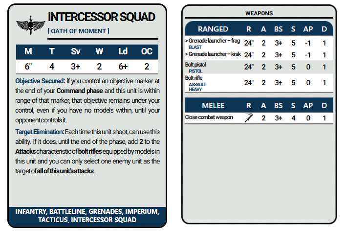

# W40K NAIPES DATACARDS
Data Card Naipes size for Table Top Warhammer 40.000 game.

## Content

[Home](https://ravog.github.io/w40k_naipes_datacards/)

- [Black Templars](https://ravog.github.io/w40k_naipes_datacards/necrons)

- [Chaos Space Marines](https://ravog.github.io/w40k_naipes_datacards/space_marines)

- [Leagues of Votann](https://ravog.github.io/w40k_naipes_datacards/space_marines)

- [Necrons](https://ravog.github.io/w40k_naipes_datacards/necrons)

- [Space Marines](https://ravog.github.io/w40k_naipes_datacards/space_marines)

- [T'au Empire](https://ravog.github.io/w40k_naipes_datacards/space_marines)

- [Tyranids](https://ravog.github.io/w40k_naipes_datacards/space_marines)

## Example - Incorrects values only for example

